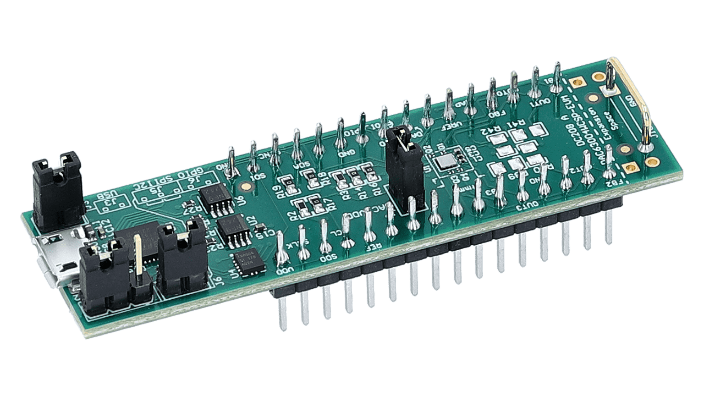

# DAC63004W EVM Driver

⚠️ **Status**: Work in Progress - Initial development

Driver and control software for the Texas Instruments DAC63004W evaluation module.


## Overview

This project provides a Linux-based driver for controlling the DAC63004W evaluation module using the FTDI interface.

## Features

- Linux-based driver implementation
- FTDI interface support
- Control software for DAC63004W evaluation module

## Prerequisites

- Linux operating system
- GCC compiler
- Make build system
- FTDI libraries

## Building

```bash
make
```

## Usage

> ⚠️ This section is under development

Basic usage instructions will be added soon. For now, you can:

1. Build the project with `make`
2. Run the executable: `./bin/dac63004 dc_voltage <channel> <voltage>`

## Contributing

Contributions are welcome! Please feel free to submit a Pull Request.

## License

This project is licensed under the MIT License - see below for details:

```
MIT License

Copyright (c) 2024 Mohamed Elazab

Permission is hereby granted, free of charge, to any person obtaining a copy
of this software and associated documentation files (the "Software"), to deal
in the Software without restriction, including without limitation the rights
to use, copy, modify, merge, publish, distribute, sublicense, and/or sell
copies of the Software, and to permit persons to whom the Software is
furnished to do so, subject to the following conditions:

The above copyright notice and this permission notice shall be included in all
copies or substantial portions of the Software.

THE SOFTWARE IS PROVIDED "AS IS", WITHOUT WARRANTY OF ANY KIND, EXPRESS OR
IMPLIED, INCLUDING BUT NOT LIMITED TO THE WARRANTIES OF MERCHANTABILITY,
FITNESS FOR A PARTICULAR PURPOSE AND NONINFRINGEMENT. IN NO EVENT SHALL THE
AUTHORS OR COPYRIGHT HOLDERS BE LIABLE FOR ANY CLAIM, DAMAGES OR OTHER
LIABILITY, WHETHER IN AN ACTION OF CONTRACT, TORT OR OTHERWISE, ARISING FROM,
OUT OF OR IN CONNECTION WITH THE SOFTWARE OR THE USE OR OTHER DEALINGS IN THE
SOFTWARE.
```

## Author

Mohamed Elazab

## Acknowledgments

- Texas Instruments for the DAC63004W documentation
- FTDI for their interface libraries
